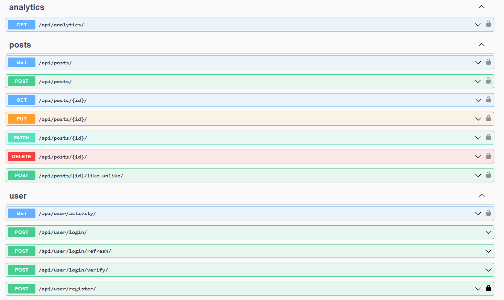

# Social Network API
 
API on Django REST Framework for posting and liking


## Project setup

```shell
git clone https://github.com/Serhii-Leonenko/social-network-api
cd social-network-api
```

❗**RENAME .env.sample to .env and fill it with your data**❗

### Run with DOCKER
*DOCKER should be installed and running on your machine.*
```shell
docker-compose up --build
```

### Local run

```shell
python3 -m venv venv
source venv/bin/activate
pip install -r requirements.txt
python manage.py migrate
python manage.py runserver
```

## Use OpenAPI documentation to have understanding about all available endpoints:
`http://127.0.0.1:8000/api/doc/swagger/`

## Features
* Create and manage posts, like-unlike posts.
* Discover likes analytics and user activity.
* Authentication by JWT with different permissions (for example, only owner can delete or update his post).

## BOT
*Added asynchronous bot for creating posts and likes*
```shell
change the configuration in the var/bot_config.json
python3 bot.py *while the server is running*
```

## Swagger looks like this:

